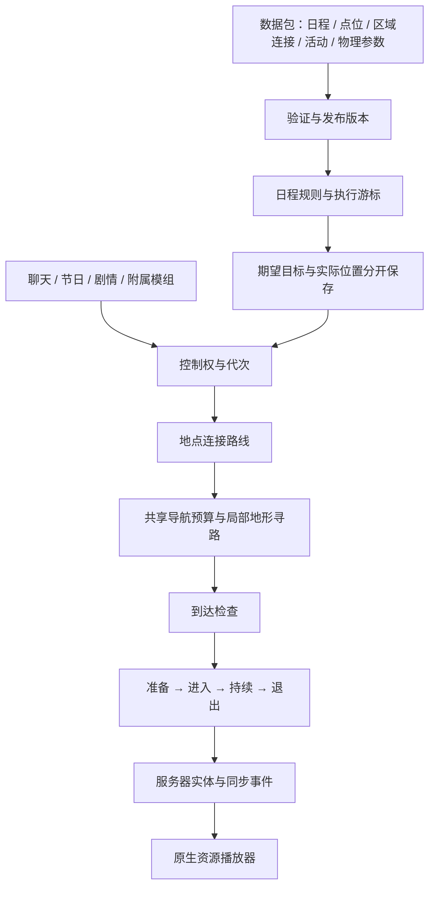

# NPC 通用运行系统：SDV 对照、执行契约与数据接口

本轮重构以所有 NPC 的共享底层为单位。普通角色、儿童、裙袍角色、轮椅角色共用日程执行、控制权、导航预算和生命周期；各自审批通过的造型、步态、转头转身动画继续作为内容资源。不是另开一个 Sam 专用系统。

## 原版依据

研究基于项目中的 Stardew Valley **1.6.15.24356** 源码，版本来自 `源文件/Properties/AssemblyInfo.cs`。这些本地参考文件不参与构建、自动测试或附属模组运行。

| 原版入口 | 确认的机制 | 本项目采用的部分 |
| --- | --- | --- |
| `NPC.parseMasterScheduleImpl` | 展开条件与 GOTO、检查循环、解析目的地、生成当日路径任务；支持初始位置与到达时间标记 | 先验证并编译日程，再执行不可变节点；保留旧字符串输入，增加结构化节点 |
| `NPC.checkSchedule` | 新到期日程排队；仍在沿旧路线行走时不直接覆盖旧控制器 | 执行游标保留途中任务；到达后按顺序领取已到期的下一站 |
| `NPC.prepareToDisembarkOnNewSchedulePath`、`finishEndOfRouteAnimation` | 新行程开始前结束到站动作，允许退出动画和回调 | 活动对接进入、持续、退出；普通聊天等待退出，再转向玩家 |
| `NPC.pathfindToNextScheduleLocation`、`WarpPathfindingCache` | 区域连接路线与地图内路径分开；门/warp 是明确连接；缺连接不能凭空穿越 | 地点图与局部导航分层；缺门口时报告等待坐标，不能删除 WALK 后只执行 WARP |
| `PathFindController.findPathForNPCSchedules` | 二维 A*、访问上限、地面偏好及减少不必要转折 | 采用预算与地面偏好的思路，局部碰撞继续使用 MC 导航 |
| `PathFindController.moveCharacter` | 检查实际包围盒到达，执行朝向和到站回调 | 使用水平距离、高度和区域共同判断；寻路结束本身不等于到达 |
| `NPC.update` | 主机处理逻辑，客户端接收网络状态并呈现动作 | 服务器发布动作事件，客户端采样；后来进入视野的玩家可从时间戳恢复阶段；客户端事件缓存独立存放，不能回写同进程服务器的数据版本 |

不能照抄的部分：SDV 是固定二维地图；MC 有高度、半砖、门的碰撞形状、宽度、区块与多个维度。原版的搜索上限不是本项目应直接复制的性能参数；原版部分离屏定位机制也不意味着可以在玩家面前用瞬移掩盖寻路失败。

本轮日程时间采用**出发/任务到期时间**。没有把 SDV 的 `a` 到达时间标记伪装成已经支持的格式；目前这种输入会被明确拒绝。长距离旅行应提供区域连接或中间道路点。

## 运行顺序与职责



`NpcSystem` 保留事件与旧调用入口；`NpcRuntimeManager` 持有每服务器的编排状态，按“刷新定义 → 日程 → 现有节日适配 → 实体驻留 → 移动”推进。现有生成、节日与商店代码承担内容适配，不能把“兼容入口还在”误认为另有一套按角色分流的新旧日程系统。

`NpcExecutionCoordinator` 管理执行租约，令牌关联实体 UUID 和代次。换实体、超时后重获控制、取消和强制位置恢复都会使旧令牌失效。日程优先级 0，活动 20，现有 authored 路线 50，聊天 80；外部租约允许 1–90。同级不能抢占。节日控制同时有明确的领域保护。

控制权真正换人时，协调器先停止旧导航、移动指令和水平惯性，并撤销旧预算/走廊请求；外部接管同时取消自主活动、回调和对话会话。随后接管方拥有导航，日程退让，不再停止接管方的新路径。活动退出后恢复行程；强制恢复位置撤销活动与过期交互回调。旧 `SamScheduleActivity` 和 `SamSupportTarget` 作为转发适配保留，新核心使用角色无关的类。

## 日程与共享世界上下文

旧格式继续有效：

```json
{"spring":{"600":"Town @example_stardew_addon:desk 2 example_stardew_addon:read"}}
```

同一节点也可使用对象：

```json
{"spring":{"600":{"location":"Town","point":"example_stardew_addon:desk","facing":2,"behavior":"example_stardew_addon:read"}}}
```

面向方向沿用 0 北、1 东、2 南、3 西。时刻按数值排序后再处理继承地点；错误分钟、缺目的地、非法朝向、GOTO 循环与悬空 GOTO 会拒绝本次 NPC 数据发布，保留前一版数据。

首次在一天中加载时选择当前已到期节点；首项尚未到期则保持无任务，每日复位使用现有 `default_spawns`，不使用未来工作点。这样避免重演早晨全部行程；运行中后续节点排队，途中任务保持。关服恢复在保存的当日检查点继续。新一天、时钟回退或数据计划更换重新建立游标。显式设置／增加时间会递增时间修订号，即使只调整十分钟或设为相同时刻，也重新选择当前已到期节点；不要求到达被跳过的旧站点。MC 时钟同步的大幅跳变（超过十分钟）也重新对齐。修订号参与解析缓存和计划身份，普通逐分钟推进不会重置队列。首次恢复不接受晚于当前时间的存档检查点。没有可达路径时保持阻塞并以退避间隔重试，不把它记作到站。

普通日程上下文首次选择单机房主，专用服务器选择稳定排序的在线参与者并保存 UUID。玩家换维度或上下线不再使上下文来回变动。`_selection_rules` 是顺序匹配规则，支持 `season`、`year`、`days`、`weekdays`（周一 0）、`weather_contains`、`any_hearts_min`、`event_seen`、`key`、`choose`；`{season}` 可代入季节。随机选择以世界种子和日期确定。

`_context: "any_player"` 明确使用所有已保存玩家中的最高好感；默认规则使用保存的世界上下文。Sam 既有语义通过这份数据声明保留，原来的专用选择函数不再是运行时分支。`_point_replacements` 支持已见事件驱动的目的地替换。未知旧式 `_condition` 不再默认通过，附属模组可注册解析器。

## 导航与失败语义

`npc/events/npc_runtime.json` 的 `navigation`：

| 字段 | 默认值 | 含义 |
| --- | --- | --- |
| `searches_per_tick` | 4 | 所有普通与脚本 NPC 共用的每 tick 搜索准入上限 |
| `max_visited_nodes` | 4096 | 单次局部搜索访问预算 |
| `search_range` | 96 | 局部搜索范围（方块） |
| `retry_ticks` / `max_retry_ticks` | 20 / 200 | 失败指数退避的初值与上限 |
| `arrival_radius` | 0.5 | 到达水平半径 |
| `vertical_tolerance` | 0.55 | 高差容忍度，兼容半砖、禁止错层抵达 |
| `corridor_radius` | 1 | 路径区块窗口两侧扩展宽度 |

准入采用 FIFO，防止遍历靠前的 NPC 持续抢走额度；同一轮移动更新不能重复申请两次搜索。MC 返回部分路径时继续走向其终点，再重新请求；不能因为 `navigation.isDone()` 就跳过剩余距离。导航在终点附近结束时，经过同区域、高差和扫掠碰撞检查，使用 MC MoveControl 补完最后一小段；不扩大到达半径，不直接改位置。

路线签名包含点位 ID、实际步骤坐标、行为和数据版本；实体 UUID 改变必须重建路线。普通计划重置不再删除同一 NPC 的剧情计划。调试快照可在默认模式读取，详细路径日志仍需调试开关。

每个 NPC 通过 `stardewcraft:npc_navigation` TicketController 持有自己的 NeoForge 票据。走廊采用有界前进窗口，结束时释放走廊；关服释放本系统票据。不会调用原版 `/forceload` 的全局开关释放别人的票据。**旧版本已遗留的原版强加载区块没有所有权信息，本轮不猜测并批量清除。**

显式缺失点位、维度不匹配、缺门口连接分别阻塞，不能偷偷退回地点中心。WARP 使用配置的明确落点，不再以落点碰撞或地面搜索否决传送。跨维度世界内容仍通过现有领域适配器（如矿井固定 NPC）接入，未宣称任意附属维度自动获得完整日程旅行图。

### 墙角与局部绕圈恢复（2026-09-14）

修正前，短窗口位移超过 0.2 格便重置卡住计数，小范围绕圈也会算作进展。位移检测触发的重试未必先停止旧导航；Minecraft 的 `createPath` 对仍有效且目标相同的路径会直接返回缓存，导致“重规划”可能没有执行搜索。最终精确接近分支还会提前返回，跳过恢复检测。

当前规则：

- 水平转角提前切换路点前检查完整身体包围盒的通行范围；不满足时先靠近当前路点中心。移动控制在尚未转正或临近目标时减速，执行器不再用上一 tick 的速度方向覆盖转向。
- 保留短窗口静止检测；同一路点连续 60 ticks 没有至少 0.1 格的新距离改善，或连续 100 ticks 未离开半径 2 格的局部范围，也会请求恢复。局部范围检测允许先远离最终目的地来绕障碍；精确接近也经过恢复检查。
- 恢复在共享 FIFO 预算准入后执行：记录失败路点、停止旧导航和水平惯性，再向原目的地重新搜索。普通无路径重试不能抢在已请求的恢复之前执行。原版导航超时停止时，保留失败路点供恢复使用。
- 失败成本仅属于当前实体：每次增加 12，上限 48，200 ticks 后过期，最多保留 32 个位置。成本加在路面基础成本上，不永久禁行；唯一出口仍能使用。没有新增长距离瞬移、改点位或恢复入口碰撞限制。

验证：`./gradlew classes runGameTestServer -PgameTestNamespaces=stardewcraft_npc_runtime --console=plain`，45 项 required GameTest 通过。新增五项覆盖一格宽直角通道、替换缓存路径并避开失败点、小范围绕圈识别、途中新增墙壁后实际绕出、成本过期/唯一出口/不同 NPC 隔离。缓存重规划测试等待共享预算准入，不要求首个 tick 必须获得搜索额度。既有门、栅栏门、传送、台阶和边缘不起跳测试同时通过。未启动额外游戏客户端，未在玩家小镇存档复现具体角落；这些结果不等于整张地图已经验收。

### 门口高度与地面通行修正（2026-09-10）

门口触发点不一定是脚底坐标：既有点位有高于地面 1–1.5 格的标记。此处曾引入入口支撑面、落地、无遮挡和落点空间检查；这些检查改变了既有点位传送语义，并未解决实际存档的入口停滞。**2026-09-13 已撤回这套入口与落点限制，以文末“明确点位直接传送”契约为准。**传送完成仍清除旧速度与跌落距离。

NPC 使用地面移动控制，不使用原版依据当前方块最高碰撞面自动起跳的判断。导航拒绝高于角色 `step_height` 的直接上升边，改走可通行路线；正向底部楼梯按两次半格台阶通行，半砖高度取实际碰撞面。角色步高由数据决定，也不靠跳跃动画掩盖边缘蹭跳。2026-09-12 修正：正式步行角色显式配置 `step_height: 1.0`，才能沿地图的一格地形台阶上坡；George 保留 0.6。缺省／附属角色仍默认 0.6，附属模组可以自行配置。上一版统一 0.6 且禁止跳跃，实际上切断了此类城镇道路。

定向回归在 `NpcTraversalGameTests`：门口高位标记往返、明确传送落点、局部碰撞边缘不起跳、整块障碍绕行、楼梯不起跳；同批保留原有穿门与半砖步行测试。入口和落点断言已随上述契约更新。运行定向 GameTest 时检查实际测试数量及结果，不能只看 Gradle 进程退出成功。

## 活动、支撑与物理参数

数据包可提供 `npc/events/*.json`，`event_id` 为本命名空间下的 `npc_activities`：

```json
{
  "event_id":"example_stardew_addon:npc_activities",
  "activities":{
    "read":{
      "actors":["example_stardew_addon:archivist"],
      "aliases":["read"],
      "asset":"example_stardew_addon:archivist_read",
      "clip_prefix":"animation.example_stardew_addon:archivist.read",
      "enter_ticks":16,"exit_ticks":16,"support":""
    }
  }
}
```

资源为 `assets/<namespace>/npc_native/<path>.json`。原生模型由资源目录发现；正常角色 clip 使用 `animation.<npcId>.idle/walk/blink`，闭眼或遮眼配置继续免除眨眼要求。服务端活动通过事件携带资源 ID、clip、进入/退出时长、世界锚点和起始时刻。既有 Sam 道具握持、音符和坐躺过渡仍使用已验收的专用姿态适配；新增活动使用通用 clip 执行路径，不必修改角色姓名名单。

支撑类型当前为 `chair` / `bed`。正式家具坐标代表家具方块，导航终点为接近点，视觉锚点为支撑点，二者必须分开。世界 anchor 分支也经过相同支撑解析。点位可声明 `origin_offset`、`approach_offset`（方块单位、三个局部坐标）；附属模组可注册其他家具方块的支撑解析。预备与活动期间检查占用、家具存在及方向；家具消失时结束活动。

**目前坐躺实体仍保留在接近点，模型绘制在支撑锚点。** 这保留了审批通过的完整进出动作，也意味着支撑状态的点击/碰撞体尚未等同于视觉身体。不能把本轮的支撑定位修复描述成已经完成姿态碰撞体系统。

`npc_runtime` 可包含 `actors`，为角色显式配置 `width`、`height`、`eye_height`、`speed`、`step_height`、`attention`。服务器应用物理规格并同步尺寸/注视能力给客户端。默认保留旧实体尺寸和速度；本轮把原来注视高度中的角色特例移入数据，没有根据性别自动套快慢或批量猜测碰撞体尺寸。

## 生命周期、问答与附属兼容

`NpcRuntimeState` 增加可选 `ActualPosition`，与日程目标分开存储。落地且处于可恢复状态时记录位置、朝向、维度和日期；关服与无人留在模拟区域时补存。相同日期恢复实际位置，旧存档缺该字段时使用原有日程恢复。下一天有明确的晨间重置。没有序列化原版路径节点或骨骼帧。

NPC 问答通过统一发送入口建立服务器待答选项。服务器只接受当前 NPC、当前页面的合法 `(answerId, points, next)`，使用后作废；关闭、注销和重开页面清除旧选项。旧网络包字段保留用于兼容，但不再作为任意好感修改或节点跳转指令。

翻译问题的服务器规则放在 `npc/events/npc_questions.json`，每个翻译键对应选项数组。附属模组使用相同命名空间格式声明问题，直接文本也可在发送时解析。服务端规则与 12 种语言中的 `$r` 控制参数必须保持一致；客户端资源包不能自行增大奖励。

新增实验接口 `StardewNpcExecution`：

- `registerCondition`：按优先级解析扩展日程条件；空结果交给后续提供者，异常隔离并记录。
- `registerSupport`：解析家具的主方块、支撑原点、接近点及两种朝向。
- `inspect`：只读获取实体、控制者、阶段、实际位置与期望目标；不把内部可变状态交给附属模组。
- `claim / isCurrent / release`：申请有期限、绑定实体代次的控制租约；调用在服务器线程上进行，异步回调回到服务器线程后先检查令牌。

已存在的 Profiles、Entities、Interactions、SocialRules、Gifts、Lifecycle、Contents 等接口保留。附属示例 `ExampleNpcExecution` 展示条件注册；不需要把 NPC 模型或逻辑复制进核心包。

## 验证与范围

执行入口：`./gradlew classes npcRuntimeRegression compileNpcAddonCompatibility checkPublicApiCompatibility checkApiMaturityReview checkSamSchedule checkNpcMovementCapabilities`；定向服务器测试：`./gradlew runGameTestServer -PgameTestNamespaces=stardewcraft_npc_runtime`。后者必须核对实际测试数量与失败报告，不能仅看 Gradle 是否返回成功。

本轮没有重新制作角色动画，没有扩充婚后、姜岛或未审批节日点位。真实城镇里仍需观察门宽、地图缺口、多人围堵和长距离绕行；定向地形测试不能替代整张城镇地图的巡检。现存商店/节日特殊生成器和领域适配没有被无依据地删除，也未宣称已经完全移除 GeckoLib 的历史兼容代码。

### 本轮已执行的结果

- `classes`、`npcRuntimeRegression`：通过，933 项断言，34 份正式日程、980 个时间节点。
- `compileNpcAddonCompatibility`、`checkPublicApiCompatibility`、`checkApiMaturityReview`：通过；新执行接口仍标记实验，不借此次重构擅自升级稳定性承诺。
- `checkSamSchedule`、`checkNpcMovementCapabilities`、`checkNativeNpcAnimation`、`checkNativeCharacterAnimation`：通过，包括既有七种活动过渡、28 位角色行走能力、转身接地与眨眼。
- NPC 专项 GameTest：六项通过，覆盖问答伪造/重放、完整世界 anchor 到家具接近点、物理规格同步、票据隔离、实际穿门/上半砖/精确走到终点、另一位角色的数据活动与 addon 租约。

验证过程中确实发现局部导航会在精确站位前结束，增加碰撞安全的最后一段行走后，地形测试通过。曾被工作区建筑 `fish_pond` 缺 family binding 阻塞；该独立修改完成后重跑通过，未为 NPC 测试绕过建筑加载校验。首次专项测试命名空间误用了共享模板命名空间，出现“没有测试”时没有将 Gradle 的成功退出当作验收，已改为跟踪在仓库中的专用测试模板。

所有结果来自当前工作区，不是干净发布构建；没有打包 JAR、提交或推送。


### 2026-09-12 调时间与上班路线回归

- 当前客户端日志中，Robin 在 `(18.21, 66, -63.10)` 停住，仍试图接近木匠家室外门口 `(28.5, 85, -114.5)`。只读检查存档，卡点周围有连续整格草地坡面；旧 0.6 步高无法通过。未修改玩家存档或点位。
- 修改 `npc_runtime.json` 的正式步行角色步高；保留地面控制、无自动起跳、角色配置及轮椅例外。测试先用旧步高确认台阶目的地不可达，再使用正式 Robin 配置走上两级地形，检查无跳跃请求、无水平传送、到达正确高度；低步高仍可绕开一格障碍。
- `StardewTimeManager` 标记显式调时，`NpcScheduleRuntimeService` 更新游标。定向测试覆盖未到晨间目的地时从 08:50 调到 09:00、继续调到 13:00、回调到 06:00；普通时间推进保留现有队列语义。
- `./gradlew classes npcRuntimeRegression --console=plain`：935 项断言通过，34 份日程、980 个节点；`./gradlew runGameTestServer -PgameTestNamespaces=stardewcraft_npc_runtime --console=plain`：实际运行 14 项，全部通过。
- 未启动客户端，未执行实际城镇里的全员日程巡检。Java 修改需重启开发客户端，仅 `/reload` 不会更新运行中的类。

### 2026-09-12 后续审查与开发进档崩溃

七项日程、锚点与移动边界修正，以及开发客户端新旧类混装、传送门重试风暴的原因和验证，见 [NPC 运行时审查记录](npc-runtime-audit-2026-09-12.md)。本次最终实际运行 22 项 NPC 专项 GameTest，全部通过；启动快照隔离检查通过。开发运行改用独立代码资源副本，已运行的旧客户端仍须完整重启。尚未完成的地表高度标志问题与实际存档验收在记录中单独列出。

后续按整条运行链进行的 [系统审查](npc-system-review-2026-09-12.md) 进一步列出 13 组问题、8 项独立 JVM 边界观察、生命周期覆盖矩阵及修复顺序。审查之后的实现与 32 项定向 GameTest 验证见 [2026-09-13 整改记录](npc-system-repair-2026-09-13.md)，其中明确列出恢复策略、通用活动进出片段、未绑定内容和实际地图验收边界。

### 2026-09-13 入口接近范围回归（首次修正，已被后续修正取代）

用户的鱼店截图显示 Willy 位于 `(65.8821897403803, 60, 151.5598185169414)`，
当前路线第一步为 `(65.5, 60, 150.5)`，导航已完成但停留 1268 tick。
最新存档的 `ActualPosition` 与截图一致。对照发布标签 `v0.5.6`：原入口步骤接受
2 格接近范围，精确终点使用 0.5 格；本轮重构将入口也收紧至 0.5 格，并移除了
导航结束的接续分支。这改变了原先可用的入口契约。

首次修正仅作用于 WALK 后紧接 WARP 的入口步骤：恢复 2 格接近范围，保留同区域、
落地和垂直高度检查，并要求到入口之间有连续支撑、视线和完整身体通行空间。
普通目的地和活动站位继续采用配置中的精确到达范围。入口站立面在开门之后解析；
不可站立时报告 `blocked_entrance / entrance_occupied`，不把它记为抵达。

回归测试按实际鱼店门口的双木门、触发块、侧边栅栏、顶半砖和 Willy 相对位置重建局部场景，
验证原接近位置可直接接续 WARP；另测四个方向的接续、墙体阻挡及普通终点不能提前完成。
这条入口接续断言在修正前失败，修正后通过。简化场景中的连续移动测试原本就能通过，
因此不能将此次测试描述成已复现真实存档中所有因素造成的长期停滞。

`classes` 与 `stardewcraft_npc_runtime` 的 34 项定向 GameTest 通过。
未启动额外游戏客户端，未修改实际存档、门口点位或既有模型；实际地图仍需重启客户端加载
修改后观察。此次结果不证明日志里的其他 `no_progress` 或 `landing_occupied` 均已解决。

### 2026-09-13 明确点位直接传送（当前契约）

用户重启后，Willy 仍停留在相同入口步骤，酒吧也有同类反馈。首次修正的测试通过不能替代实际存档结果。用户明确要求恢复“到室外入口附近，直接传送到配置的室内入口”，不以实体穿门条件限制地点切换。

- 仅对 WALK 后紧接 WARP 的入口步骤，水平距离不超过 2 格、与入口标记高差不超过 2 格即可接续。入口接续不要求 `onGround`、区域判定、连续支撑、视线或身体扫掠通行；普通工作点和活动站位仍采用原来的精确到达规则。
- WARP 保证目标区块加载后直接使用该步骤的明确坐标；不搜索支撑面、不重新选落点、不因碰撞或无地板等待，不改变配置的 Y。删除不再使用的 `NpcPortalTraversal`。传送仍停止旧导航并清除运动输入、速度及跌落距离。
- 门操作属于实际步行路径：只打开附近即将经过的路径节点上的木门，不扫描 NPC 周围或入口旁的门。移除定时关门规则；门仍在前方路径上或有人占据门口时保持开启，通过后关闭，避免尚未通过就反复开关。
- 原版寻路把可打开的关闭木门转换成 `WALKABLE_DOOR`。新增的碰撞检查和地面代价此前遗漏了这种类型，现与可穿行木门一致处理，避免把可开门判成障碍或因漏算代价而偏向旁边的门。

修改前，新增回归中四项失败：鱼店恢复状态入口接续、遮挡入口接续、半砖旁明确落点、无地板明确落点。修改后，`./gradlew classes runGameTestServer -PgameTestNamespaces=stardewcraft_npc_runtime --console=plain` 编译成功，实际运行 **35 项必需测试，全部通过**。穿门测试检查通过前不提前关门、通过后关闭且不重新打开；旁路测试检查旁边的门始终关闭。旁路测试曾因 Pierre 实际步速而超时，位置与速度记录确认仍在前进，因此只延长测试时限，未修改步速。

本轮未修改真实存档、入口坐标或模型，也未启动额外客户端。开发客户端必须完整重启才能加载 Java 修改；这些结果仍不等同于实际城镇全员日程已经验收。

### 2026-09-13 绕墙角时的碰撞抬升

用户确认入口传送改善后，反馈 NPC 会爬上路径旁的一格墙角再落下。禁用 `JumpControl` 的主动跳跃不足以阻止此行为：原版 `Entity` 碰撞解算仍会使用一格 `STEP_HEIGHT`，只要抬升能获得更多水平位移，就可能把擦碰侧边方块当成可上台阶。

`StardewNpcEntity` 现在仅在服务端自身移动的碰撞解算期间收紧 `maxUpStep()`：实际可抬升高度不超过 `NpcMoveControl` 当前转向目标的剩余上升高度，也不超过角色配置步高；没有主动行走目标时不自动抬升。平地目标不能借侧边高块升高。寻路查询仍获得完整配置步高，保留正常整格坡地、半砖和楼梯路线；没有降低全员步高或更改路径数据。

新增 `levelPathDoesNotStepOntoClippedCorner`，使用正式一格步高及全部位于平地的路径节点，让略偏离中心线的身体擦过侧边方块。修改前实体被抬高一格，且没有跳跃请求；修改后全程保持地面高度并走到终点。`classes` 和 NPC 专项 **36 项必需 GameTest 全部通过**，包括既有整格坡地、楼梯、半砖、木门与入口传送回归。未启动游戏客户端，实际地图墙角仍由用户重启后观察验收。

### 2026-09-13 入口音效与小镇卡顿初查

- 原版 `StardewValley.Pathfinding/PathFindController.cs` 的地点切换在门口播放 `doorClose`，项目已有 `door_close` 注册和 `doorclose.ogg`。WARP 成功后向入口或出口附近的玩家播放该资源，使用世界坐标和 NPC 声音分类。按玩家所在室内区域和距离选择一个端点，16 格外不发送；同一玩家不会因两端接近而听到两次。等待、重寻路与普通站位传送不触发这条音效，亦不为声音打开实体木门。
- 用户该次客户端于 11:03 退出。已读日志在 10:55–11:02 多次记录 `residencyMs` 约 34–65 毫秒，同次 `movementMs` 通常不到 1 毫秒。这是服务端驻留阶段的耗时证据，不是客户端 FPS 或 GPU 采样结果。
- `NpcSpawnManager` 原先用覆盖 X/Z 正负 3000 万的 AABB 获取已加载 NPC。MC `EntitySectionStorage.forEachAccessibleNonEmptySection` 会按查询的 X 区段范围逐列循环，这里约为 375 万列，空列也有遍历代价。现改用 `ServerLevel.getEntities(EntityTypeTest, predicate)` 的已加载实体索引，仍保留缓存、NPC 子类和去重恢复逻辑。
- `LuckyPurpleShortsWorldEvents` 每 40 tick 的怪物清理、`NpcDebugCommand` 的 NPC 查询有相同的全球范围扫描，均改用已加载实体查询；不会为查找实体加载额外区块。
- 新增 `loadedNpcQueryPreservesSubclassAndRemoval` 对比两种查询的成员集合，检查子类和移除后刷新。在一个已加载 NPC 的定向场景中测得旧查询 **47.131333 ms**、新查询 **0.67 ms**；时间仅作为诊断记录，不设容易受机器负载影响的 CI 时限。这个单次小场景测量不能换算成小镇 FPS。
- `classes` 和 NPC 专项 **37 项必需 GameTest 全部通过**。进出门的实际听感、小镇渲染线程、GC 和帧率采样仍待用户启动客户端并进入小镇；本轮没有启动额外游戏窗口，也不宣称全部掉帧原因已排除。

### 2026-09-13 小镇现场复测与栅栏门

用户启动客户端后的三段 JFR、灌木与提示扫描优化、用户批准关闭的 KubeJS Web 服务，以及重启复测边界，见 [小镇现场性能记录](town-performance-2026-09-13.md)。这不是固定镜头 FPS 基准，也不替代地图行为验收。

用户另报告酒吧路线中的栅栏门无法通过。原因有两层：原版寻路将关闭的栅栏门分类为 `FENCE`，执行器也只处理 `DoorBlock`。现由 NPC 节点评估器将关闭栅栏门视为可打开木门，沿用已有开门通行能力和地面代价；只在原分类为 `FENCE` 时补查方块，不增加普通格子的重复读取。普通栅栏仍是障碍。

实际行走路径即将经过栅栏门时才打开，按接近方向调整开启朝向，播放该栅栏门自身的开关音效并发出方块事件。通过且门口无人后关闭，只清理本计划打开的门；原本开启的门保持开启，后来通电的门交由红石控制。入口 WARP 和旁边无关的门不触发这套逻辑。

新增东西、南北两个单格通道往返测试，修改前均因关闭栅栏门被排除而失败。修正后检查可规划穿门、保持地面高度、无跳跃或传送、通过前不关门、往返各开一次并在通过后关闭；另测已开启和通电栅栏门的清理语义。`classes` 及 NPC 专项 **40 项必需 GameTest 全部通过**。酒吧实际地图的栅栏门仍需下次重启加载本次 Java 修改后观察。
